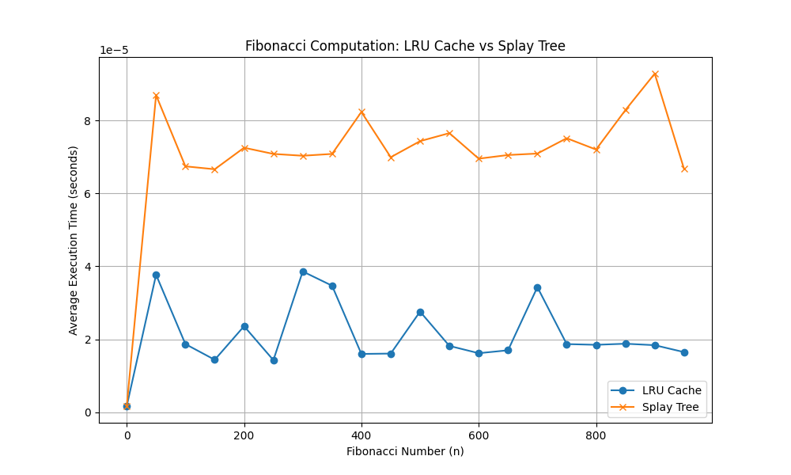

# Завдання 2. Порівняння продуктивності обчислення чисел Фібоначчі із використанням LRU-кешу та Splay Tree

Відповідно до графіку - "LRU Cache" підхід є ефективнішим для обчислення чисел Фібоначчі на великих значеннях n.